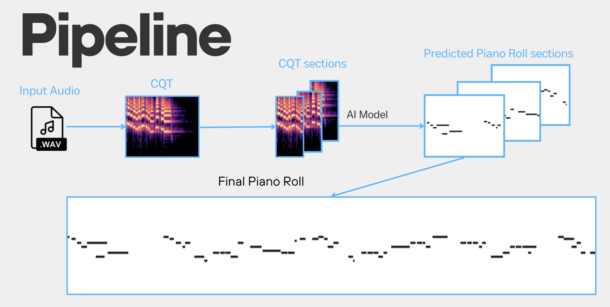

# Audio2PianoRoll

> **Audio2PianoRoll** is a deep learning-based approach for **Automatic Music Transcription (AMT)** that converts isolated guitar audio into a **Piano Roll** representation, which can then be transformed into MIDI format and Sheet music. This project leverages **Constant-Q Transform (CQT)** as an input representation and employs a **U-Net architecture** for transcription.



## Motivation
- **Limited research** on guitar transcription compared to piano.
- **Piano Roll representation** is information-rich and facilitates MIDI conversion.
- **Potential applications**: feature extraction for music analysis, generation of sheet music and guitar tabs.

## Dataset
The project utilizes **GuitarSet**, which consists of:
- **360 audio files** across **4 recording modalities** (data augmentation applied).
- **Rich annotations**: pitch, MIDI, tempo, guitar fret positions, etc.

## Input Representation
**Constant-Q Transform (CQT)** is used due to its:
- **Logarithmic frequency scaling**, aligning well with musical scales.
- **Rich feature representation**, improving transcription accuracy.

## Model Architecture
### **U-Net** (Convolutional Neural Network for Segmentation)
- Encoder-Decoder structure with **skip connections**.
- Designed originally for **biomedical image segmentation**, adapted here for **music transcription**.
- **Final output**: Binary piano roll representation of detected notes.
- **Original U-Net Paper:** [Ronneberger et al. (2015)](https://arxiv.org/abs/1505.04597)

### **Pipeline**
1. **Input:** CQT spectrogram.
2. **Processing:** Spectrogram is divided into overlapping sections (50% overlap).
3. **Model Training:** Binary Cross-Entropy (BCE) and Mean Squared Error (MSE) losses.
4. **Output:** Predicted piano roll sections reconstructed into full transcription.

## Repository Structure
```
├── src/
│   ├── config.py                     # Signal-processing constants, dataset location resolution
│   ├── model.py                      # CQT U-Net architecture (with tensor shape comments)
│   ├── losses.py                     # Combined BCE + MSE loss
│   ├── training.py                   # Training loop with per-track gradient accumulation
│   ├── evaluation.py                 # Inference, precision/recall/F1, piano roll plots
│   └── data/
│       ├── guitarset.py              # GuitarSet dataset, windowing, overlap reconstruction, split
│       └── midi_utils.py             # JAMS/MIDI → piano roll conversion
├── scripts/
│   ├── train.py                      # CLI training entry point
│   └── evaluate.py                   # CLI evaluation entry point
├── notebooks/
│   └── results_showcase.ipynb        # Training record and evaluation results with plots
├── test_split.json                   # Persisted test split (portable file basenames)
└── Audio2PianoRoll.pdf               # Project report
```

## Quick Start

```bash
pip install -r requirements.txt

# download GuitarSet (audio + annotations) from https://guitarset.weebly.com/
# and point the code to it:
export GUITARSET_DIR=/path/to/guitarset

python scripts/train.py                                    # train (144 epochs by default)
python scripts/evaluate.py --checkpoint models/final144.pth  # evaluate on the saved test split
python scripts/evaluate.py --full-roll                     # evaluate on reconstructed full rolls
```

**Trained weights:** `models/final144.pth` is distributed via [GitHub Releases](../../releases) — download it into `models/` to skip training.

## Training Details
- **Weight Initialization:** He initialization for convolutional layers, Xavier for fully connected layers.
- **Dataset Split:** 80% training, 20% testing.
- **Epochs:** Trained for **144 epochs** with final loss **0.0069**.

## Results
- **F1-score:** 83%
- **Precision:** 85%
- **Recall:** 82%

## Future Work
- **Expanding to multiple instruments.**
- **Enhancing post-processing for cleaner predictions.**
- **Experimenting with different model parameters** (e.g., window overlap size).
- **Improving transcription quality using advanced techniques.**

## License
This project is licensed under the MIT License.

## Author
**Francesco Brigante** - Computer Science student, Sapienza Università di Roma

